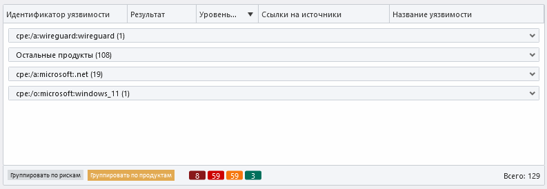
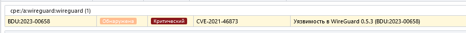
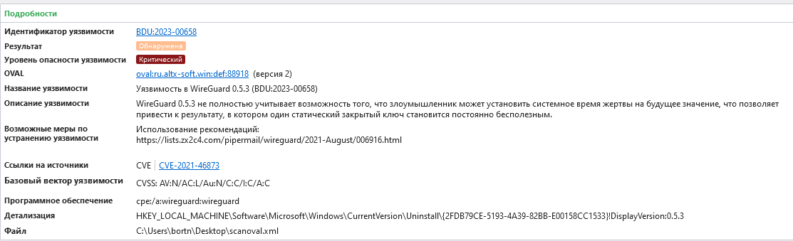
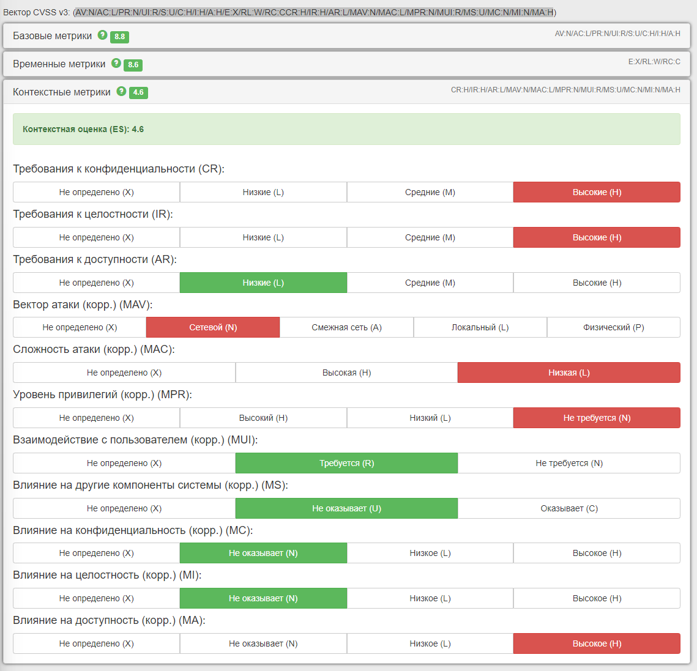

# Задание 2
## Экспериментальный анализ уязвимостей 
Бортников Павел 20215

Всего было выявлено 129 уязвимостей из которых:
* 8 критических
* 59 высоких
* 59 средних
* 3 низких

В основном все уязвимости связаны с OpenSSL и .NET
Так как на ПК установлено не так много софта, то и других уязвимостей не так много. Одна связанная с VPN Wireguard, одна системная для Windows 11 и одна для IE и Edge браузеров.

Рассмотрим 3 критических угрозы

## 1. Wireguard 
Уязвимость в wireguard 0.5.3

https://bdu.fstec.ru/vul/2023-00658

https://cve.mitre.org/cgi-bin/cvename.cgi?name=CVE-2021-46873

### Описание: 
Уязвимость реализации протокола синхронизации времени NTP VPN-сервиса WireGuard операционных систем Windows связана с недостаточной проверкой входных данных. Эксплуатация уязвимости может позволить нарушителю, действующему удаленно, вызвать отказ в обслуживании

### Метрики:
(AV:N/AC:L/PR:N/UI:R/S:U/C:H/I:H/A:H/E:X/RL:W/RC:CCR:H/IR:H/AR:L/MAV:N/MAC:L/MPR:N/MUI:R/MS:U/MC:N/MI:N/MA:H)
* Базовая - 8,8 (AV:N/AC:L/PR:N/UI:R/S:U/C:H/I:H/A:H)
* Временная (в банке данных отмечено, что возможность эксплойта уточняется) - 8,6 (E:X/RL:W/RC:C) 
* Контекстная - 4,6 (CR:H/IR:H/AR:L/MAV:N/MAC:L/MPR:N/MUI:R/MS:U/MC:N/MI:N/MA:H)

### Исправление 
Использование рекомендаций: https://lists.zx2c4.com/pipermail/wireguard/2021-August/006916.html

Компенсирующие меры:
1) Использование протокола синхронизации времени аналогичного NTP ( NTPSec, NTS, Chrony и др.)
2) Использование значения счетчика равное 1 и увеличение его в каждой последующей фазе на единицу

## 2. WinVerifyTrust

https://bdu.fstec.ru/vul/2022-01339

https://nvd.nist.gov/view/vuln/detail?vulnId=CVE-2013-3900

### Описание:
Уязвимость функции WinVerifyTrust операционной системы Windows связана с неправильной проверкой дайджестов PE-файлов во время проверки подписи Authenticode. Эксплуатация уязвимости может позволить нарушителю, действующему удалённо, выполнить произвольный код с помощью специально созданного подписанного PE-файла

### Метрики:
* Базовые - 7,5 (AV:N/AC:H/PR:N/UI:R/S:U/C:H/I:H/A:H)
* Временные - 7,2 (E:X/RL:O/RC:C)
* Контекстные - 7,2 (CR:H/IR:H/AR:H/MAV:N/MAC:H/MPR:N/MUI:R/MS:U/MC:H/MI:H/MA:H)

### Исправление 
Рекомендации производителя https://msrc.microsoft.com/update-guide/vulnerability/CVE-2013-3900

## 3. Visual Studio

https://bdu.fstec.ru/vul/2023-05594

https://web.nvd.nist.gov/view/vuln/detail?vulnId=CVE-2023-36792

### Описание:
Уязвимость средства разработки программного обеспечения Microsoft Visual Studio связана с недостаточной проверкой входных данных. Эксплуатация уязвимости может позволить нарушителю выполнить произвольный код

### Метрики:

* Базовая - 7,8 (AV:L/AC:L/PR:N/UI:R/S:U/C:H/I:H/A:H)
* Временные - 6,8 (E:U/RL:O/RC:C)
* Контекстная - 0 (тк локальное исполнение) (CR:H/IR:H/AR:H/MAV:L/MAC:H/MPR:H/MUI:R/MS:U/MC:N/MI:N/MA:N)

### Устранение:

Использование рекомендаций и обновление до последней версии.

